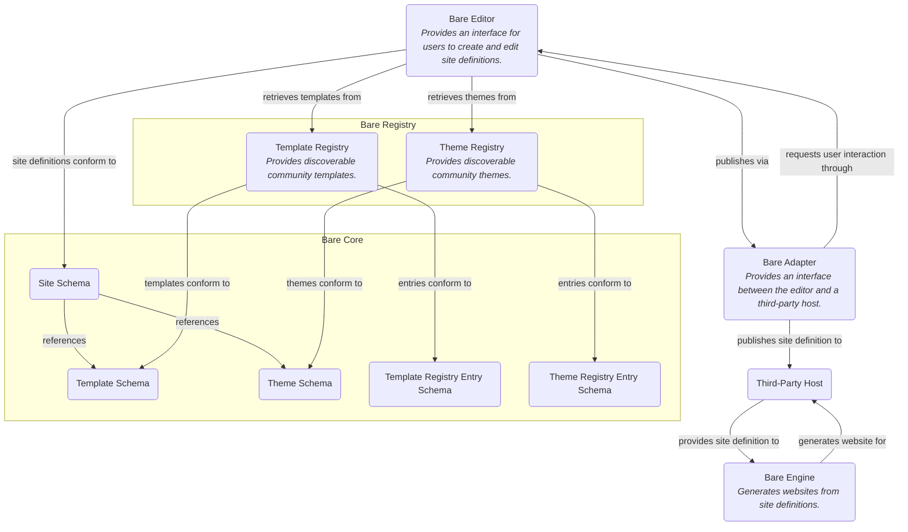

```mermaid
flowchart TB
  subgraph Bare Core
    A(Site Schema)
    B(Template Schema)
    C(Theme Schema)
    D(Template Registry Entry Schema)
    E(Theme Registry Entry Schema)
  end

  subgraph Bare Registry
    F(Template Registry<br><i>Provides discoverable community templates.</i>)
    G(Theme Registry<br><i>Provides discoverable community themes.</i>)
  end

  H(Bare Editor<br><i>Provides an interface for users to create and edit site definitions.</i>)
  I(Bare Adapter<br><i>Provides an interface between the editor and a third-party host.</i>)
  J(Bare Engine<br><i>Generates websites from site definitions.)
  K(Third-Party Host)

  A --> |references| B
  A --> |references| C
  H --> |site definitions conform to| A
  H ---> |publishes via| I
  H --> |retrieves templates from| F
  H --> |retrieves themes from| G
  I --> |requests user interaction through| H
  I --> |publishes site definition to| K
  J --> |generates website for| K
  F ---> |templates conform to| B
  F ---> |entries conform to| D
  G ---> |themes conform to| C
  G ---> |entries conform to| E
  K --> |provides site definition to| J
```
