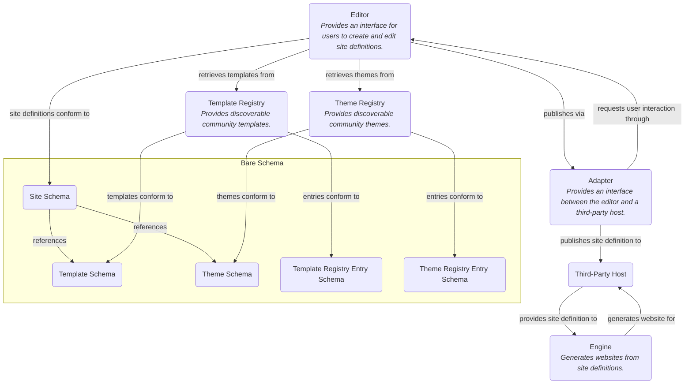

```mermaid
flowchart TB
  subgraph Bare Schema
      A(Site Schema)
      B(Template Schema)
      C(Theme Schema)
      D(Template Registry Entry Schema)
      E(Theme Registry Entry Schema)
  end

  F(Editor<br><i>Provides an interface for users to create and edit site definitions.</i>)
  G(Adapter<br><i>Provides an interface between the editor and a third-party host.</i>)
  H(Engine<br><i>Generates websites from site definitions.)
  I(Template Registry<br><i>Provides discoverable community templates.</i>)
  J(Theme Registry<br><i>Provides discoverable community themes.</i>)
  K(Third-Party Host)

  A --> |references| B
  A --> |references| C
  F --> |site definitions conform to| A
  F ---> |publishes via| G
  F --> |retrieves templates from| I
  F --> |retrieves themes from| J
  G --> |requests user interaction through| F
  G --> |publishes site definition to| K
  H --> |generates website for| K
  I ---> |templates conform to| B
  I ---> |entries conform to| D
  J ---> |themes conform to| C
  J ---> |entries conform to| E
  K --> |provides site definition to| H
```
